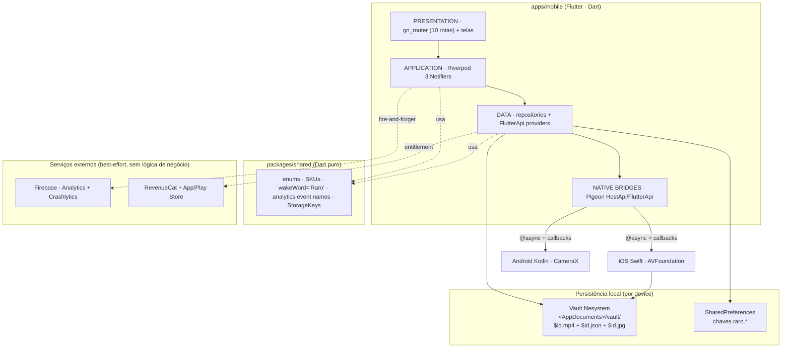

# 11-SYSTEM-DESIGN — RARO (System Design Doc)

> Status: Draft · Data: 2026-07-14 · Fonte do design: skill `system-design-blueprint`
> Escopo: documentar formalmente a arquitetura **client-only que já existe** (congela a verdade atual contra drift). NÃO propõe backend novo.
> Complementa (não substitui): [02-ARCHITECTURE.md](02-ARCHITECTURE.md) (camadas/topologia), [07-NATIVE-BRIDGES.md](07-NATIVE-BRIDGES.md) (bridges), [Blueprint.md](Blueprint.md) (decisões). Decisão de arquitetura registrada em [ADR-0026](decisions/0026-system-design-client-only.md).

---

## 0. Enquadramento honesto — por que este SDD é diferente

A skill `system-design-blueprint` foi feita para sistemas distribuídos (QPS, servidores, réplicas, sharding, filas, CDN). O RARO é **client-only, single-node por device** (ADR-0004): não há servidor, banco central, nem API própria. Aplicar CAP aqui é trivial — **não há partição de rede a tolerar**, cada device é uma ilha `CA` de nó único (fonte: System Design 101 / CAP, Context7 `/bytebytegohq/system-design-101`).

Consequência: a maioria dos "componentes" clássicos (cache distribuído, read replica, message queue, CDN) **não tem gargalo que os justifique** — adicioná-los seria slop arquitetural, que a skill proíbe. Este SDD reinterpreta as 6 etapas para os gargalos que o RARO *realmente* tem:

- **"Escala" não é DAU/QPS** → é **crescimento de bytes de vídeo no device** e **custo de varredura do vault**.
- **"Consistência"** não é replicação → é **sincronia entre o estado nativo-assíncrono (câmera/gravação/voz) e o estado Riverpod** (bug histórico REC travado, memória `raro-pattern-flutter-async-native-state-needs-notifier`).
- **"Durabilidade"** → integridade do sidecar sob crash e do formato gravado (fallback silencioso, ADR-0021).

---

## 1. Problema & Feature Núcleo

- **Problema:** capturar vídeo em campo (pesca, esporte, trilha) sem tocar o aparelho, e não perder o "momento certo" que já passou.
- **Feature núcleo (a paga):** salvar na galeria do sistema o vídeo capturado — incluindo o **Raro Replay** (últimos 15/30 s antes do comando). O gate de assinatura é exatamente sobre *salvar na galeria*; o resto do app funciona sem assinatura (fonte: [01-PROJECT.md](01-PROJECT.md)).
- **Entrada:** frames da câmera nativa (AVFoundation/CameraX) + gatilho (voz "Raro" / botão de volume / toque na UI).
- **Saída:** arquivo `.mp4` no vault local + sidecar de metadados + thumbnail; opcionalmente exportado para a galeria do SO.
- **Fluxo do usuário:** abrir → (onboarding/permissões 1ª vez) → câmera → comando hands-free → grava (ou salva replay) → clipe aparece na galeria interna → preview → export (requer assinatura).
- **Monetização:** assinatura recorrente, 30 dias grátis, Mensal R$ 9,90 / Anual R$ 89,90 (SKUs em `packages/shared/.../subscription.dart`; ADR-0010).
- **Restrições:** client-only (ADR-0004); iOS 15+/Android API 24+; captura em background proibida no iOS; wake word imutável = `"Raro"` (ADR-0009).

---

## 2. Requisitos

### Funcionais (o que o sistema faz hoje, por bridge)

- **FR-1 Câmera:** descobrir lentes/formatos, iniciar/parar sessão, alternar lente 0.5×/1×, setar resolução/fps, foco por toque. Contrato: `CameraHostApi`/`CameraFlutterApi` (`pigeons/camera_api.dart`). **iOS funcional; Android parcial** (recording/thumbnail = stub até Bloco 3.1).
- **FR-2 Gravação:** iniciar/parar gravação, opcionalmente com pré-roll de replay embutido (`RecordingOptions.includeReplayPreroll`). Callbacks `onRecordingStarted/Finished/Failed`.
- **FR-3 Replay Buffer:** manter janela circular de 15/30 s em RAM, salvar sob comando. Contrato `ReplayBufferHostApi`. **iOS funcional; Android stub e NÃO registrado no `MainActivity`.**
- **FR-4 Voz:** wake word "Raro" foreground (SFSpeech), dispara start/stop de gravação. `VoiceHostApi`/`VoiceFlutterApi`. **iOS funcional; Android ausente.**
- **FR-5 Vault:** salvar clipe + sidecar + thumbnail, listar, abrir, deletar (`vault_service.dart`).
- **FR-6 Assinatura:** trial/estado de assinatura persistido; gate no export para galeria. **Hoje mock (bool local); RevenueCat real = Bloco 2.**
- **FR-7 Config:** resolução/fps/buffer/modo-de-controle/idioma/onboarding persistidos.
- **FR-8 Volume trigger:** capturar botões físicos de volume. **Contrato Pigeon existe (`volumePing`/`volumeReady`) mas SEM implementação em nenhuma plataforma nem consumidor Dart** — é o bridge menos maduro.

### Não-funcionais (os NFRs que dão o critério de "parar de escalar")

- **Latência de interação de câmera** (gate §10 CLAUDE.md): tap→ring visível < 50 ms; tap→foco travado < 300 ms. Fonte de verdade: gate manual em iPhone físico + harness E2E (ADR-0016).
- **Integridade de formato:** o clipe gravado deve ter exatamente a resolução/fps/codec pedidos (sem fallback silencioso). Prova objetiva via `ffprobe` no device (ADR-0021).
- **Consistência de estado nativo↔Dart:** o estado exibido (REC on/off, listening) reflete o estado real do nativo — via Notifier reativo escutando stream, nunca bool local (memória `...async-native-state-needs-notifier`).
- **Durabilidade do sidecar:** leitura nunca observa sidecar parcial (escrita atômica tmp+rename; testado em `vault_service_race_test.dart`).
- **Disponibilidade:** app 100% offline-first; nenhuma feature núcleo depende de rede. Firebase/Crashlytics/Analytics são best-effort (falham silenciosamente sem quebrar captura).
- **Consistência (CAP):** N/A distribuído — nó único `CA`. Source of truth de cada dado é local (ver §4).

### Fora-de-escopo (nesta fase / por decisão de produto)

- Backend próprio, contas de usuário na nuvem, sync entre devices, backup de vídeos na nuvem (violaria ADR-0004 — exigiria novo ADR).
- Wake word em background no Android/iOS (ONNX próprio inviável, sessão 0029; Sensory em validação).
- OLAP/analytics agregado no device (analytics é fire-and-forget para o Firebase).

---

## 3. Estimativas (reinterpretadas para on-device)

Não há QPS/DAU dimensionando servidor. O número que dimensiona o sistema é **crescimento de storage por device** e **custo de leitura do vault**.

- **Usuários simultâneos por "nó":** 1 (o dono do device). Não há concorrência multi-usuário.
- **Tamanho por registro (clipe):** dominado pelo vídeo. Ordem de grandeza por resolução/fps — **[VERIFICAR com `ffprobe` em clipes reais no device]**; bitrates dependem do encoder AVFoundation/MediaCodec. Sidecar JSON é ~200–400 bytes; thumbnail JPG ~10–50 KB.
- **Crescimento de storage:** linear com minutos gravados. Um app de captura de campo pode acumular dezenas de clipes/sessão → o vault cresce sem teto e **não há política de retenção automática** (só delete manual). **Suposição declarada.**
- **Razão leitura×escrita do vault:** **read-heavy na galeria** — cada abertura da galeria chama `listAll()`, que faz **scan + parse de TODOS os sidecars** e ordena por `recordedAt` (`vault_service.dart:51-66`). É O(n) no total de clipes, a cada abertura.
- **Retenção:** indefinida (dono decide). Sidecar e vídeo vivem até delete manual.
- **[VERIFICAR]:** bitrate real por formato (720p/1080p/4K/4K60, h264/h265) para estimar quando o scan O(n) do vault ou o storage viram problema perceptível.

---

## 4. Dados, APIs & Retenção

### Store (OLTP local, não há OLAP)

Dois mecanismos de persistência, ambos no device:

**(A) Vault de vídeos — filesystem** em `<AppDocuments>/vault/` (via `getApplicationDocumentsDirectory`, `vault_service_provider.dart:8-10`). Layout **flat, por id**:

| Arquivo | Conteúdo |
|---|---|
| `vault/$id.mp4` | vídeo (extensão hardcoded `.mp4`, `vault_service.dart:14`) |
| `vault/$id.json` | sidecar de metadados |
| `vault/$id.jpg` | thumbnail (opcional) |

**Schema do sidecar** (`RecordingMetadata`, `_encode` em `vault_service.dart:93-101`):

| Campo | Tipo JSON | Nota |
|---|---|---|
| `id` | string | também é o nome do arquivo |
| `name` | string | rótulo exibido |
| `durationMs` | int | `Duration.inMilliseconds` |
| `recordedAt` | string ISO8601 | chave de ordenação da galeria |
| `isReplay` | bool | distingue replay de gravação normal |
| `thumbnailHue` | int | cor de fallback quando não há JPG |
| `thumbnailPath` | string (opcional) | só gravado se não-nulo |

> **Decisão de schema registrada:** o sidecar é **mínimo por design** — NÃO persiste `path` (derivado do id em runtime, evitando o bug de UUID de container stale — memória `...ios-container-uuid-stale-absolute-path`), nem `resolution`/`fps`/`codec` por vídeo. *Ver §7 Riscos: se algum dia a galeria precisar filtrar/exibir por formato, o schema precisa migrar — hoje essa informação se perde após a gravação.*

**(B) Config/estado leve — `SharedPreferences`** (`SharedPreferencesAsync`), chaves com prefixo `raro.` centralizadas em `StorageKeys` (`packages/shared/.../storage/storage_keys.dart`): resolução, fps, buffer, `controlMode` (voice/volume), idioma, onboarding, `subscription.active`, `trial_started_at`, guias Xiaomi. Codificação por `.name` de enum, decode tolerante a default (`recording_settings_codec.dart:50-56`).

### Contratos de API (fronteira Pigeon — a "API" do sistema é nativo↔Dart)

Quatro domínios Pigeon (`apps/mobile/pigeons/*.dart`), cada um gera Dart+Swift+Kotlin. Padrão: **HostApi** = Dart→nativo (imperativo, muitos `@async`); **FlutterApi** = nativo→Dart (eventos/callbacks). Detalhe canônico em [07-NATIVE-BRIDGES.md](07-NATIVE-BRIDGES.md); assinaturas completas ficam nos `.dart` de pigeon (fonte única — não duplicar aqui para não driftar).

- **Idempotência / erro na fronteira:** códigos de erro são enums (`CameraErrorCode`), nunca `String(rawValue)` cru (hook `block-pigeon-error-rawvalue`, ADR-0013). `startSession` protege contra duplo-start (`alreadyRunning`).

### Source of truth por entidade

| Entidade | Source of truth | Como o resto lê |
|---|---|---|
| Frames/sessão de câmera | **Nativo** (AVFoundation/CameraX) | `CameraFlutterApi` callbacks → stream → `CameraController` |
| Estado de gravação (REC on/off) | **Nativo** | `recordingEvents` stream → `RecordingController` (Notifier, nunca bool local) |
| Janela de replay em RAM | **Nativo** (buffer circular) | `ReplayBufferFlutterApi` |
| Clipe salvo + metadados | **Filesystem vault** (`$id.json`) | `VaultService.listAll()` → `videoListProvider` |
| Config (resolução, modo, idioma) | **SharedPreferences** | controllers Riverpod persistidos |
| Assinatura/trial | **RevenueCat/lojas** (hoje mock local) | `subscriptionController` |
| Telemetria/crashes | **Firebase** (write-only, best-effort) | `camera_analytics_listener` |
| Wake word | **Constante** `VoiceConfig.wakeWord='Raro'` | imutável, não persistido |

---

## 5. Arquitetura

### Diagrama

### Componentes & justificativa (regra: um componente só entra se resolve um gargalo real)

| Componente | Resolve qual gargalo | Trade-off aceito | Consumidor |
|---|---|---|---|
| Native bridges (Pigeon) | Plugin `camera` oficial não alterna lente física 0.5×/1× nem faz replay buffer em RAM (ADR-0002/0003) | Manter 2 impl nativas (iOS/Android) em paridade | `CameraController`, `RecordingController`, etc. |
| Stream + Notifier reativo | Estado nativo-assíncrono dessincronizava do Dart (REC travava com bool local) | Boilerplate de StreamController.broadcast por bridge | `RecordingController`/`ReplayBufferController`/`VoiceController` |
| Sidecar JSON por clipe (sem DB) | Não há gargalo que justifique SQLite/DB para o volume esperado; filesystem basta | `listAll()` é O(n) scan+parse — aceitável até vault ficar grande (ver §6) | `videoListProvider` |
| Escrita atômica tmp+rename | Race read-during-write corrompia a galeria (`FormatException`) | Só cobre o JSON, não a cópia do `.mp4` | `listAll()` (lê só `.json`) |
| Firebase (Analytics+Crashlytics) | Sem observabilidade, crash em release era cego | Best-effort; não bloqueia captura | painel do dono |

> **Componentes deliberadamente AUSENTES** (sem gargalo que os justifique): banco central, cache distribuído, read replica, message queue, CDN, load balancer, API gateway. Adicioná-los violaria anti-YAGNI.

---

## 6. Plano de Evolução (loop de simulação por gargalo real)

Simulação aplicada aos gargalos on-device, não a QPS.

| Iteração | Carga / cenário | Gargalo | Ação (um componente/mudança) | Ganho esperado | Próximo gargalo |
|---|---|---|---|---|---|
| 0 | Uso normal, poucos clipes | — | Arquitetura atual (bridges → vault → prefs) | baseline funcional (iOS) | paridade Android |
| 1 | Vault com **centenas de clipes** | `listAll()` faz scan+parse O(n) de todos os sidecars a cada abertura da galeria → jank | **[Futuro, só quando medido]** índice único (1 JSON manifesto OU SQLite) atualizado no save/delete | leitura O(1)/O(log n) | tamanho do manifesto |
| 2 | Storage do device **enchendo** | Sem retenção automática; vault cresce sem teto | **[Futuro, produto]** política de retenção / aviso de espaço / limpeza | usuário não trava por disco cheio | UX de gestão de espaço |
| 3 | Galeria precisa **filtrar por formato** | Sidecar não persiste resolução/fps/codec (perde-se pós-gravação) | Migração de schema do sidecar (+campos) | filtro/exibição por formato | migração de sidecars legados |
| 4 | **Android** em produção | replay stub + não registrado; voice ausente; volume sem impl | Bloco 3 (gravação real, registrar HostApis, impl voice/volume) | paridade de plataforma | manutenção 2 nativos |

**Parada:** os NFRs (§2) são atendidos **hoje no iOS** para uso normal (iteração 0). Iterações 1–4 só disparam quando o gargalo for **medido**, não preventivamente. Nenhuma delas exige backend.

---

## 7. Riscos & Decisões em aberto

- **Cobertura de analytics ~6,25%:** 32 eventos definidos em `analytics_events.dart`, só **2 wired** (`camera_started`, `camera_error` no `camera_analytics_listener.dart`). Os outros 30 (recording, voice, replay, paywall, checkout, gallery, settings, onboarding) não têm emissor. É **cobertura, não drift de schema** — mas significa que o funil de conversão/uso está cego hoje. (Já registrado como pendência no ADR-0025.)
- **`volume` bridge é só contrato:** Pigeon gerado (`volumePing`/`volumeReady`), zero impl nativa e zero consumidor Dart. O "modo Volume OFF" do produto (ADR-0011) não existe em código ainda.
- **Sidecar não persiste formato:** resolução/fps/codec se perdem após a gravação. Se a galeria/preview algum dia precisar disso, é migração de schema (iteração 3).
- **Atomicidade parcial:** só o sidecar é tmp+rename; a cópia do `.mp4` (`source.copy`) não é atômica — um crash no meio da cópia pode deixar `.mp4` truncado sem sidecar (mas `listAll()` filtra por `.json`, então o clipe simplesmente não aparece — falha segura, não corrupção da galeria).
- **3 telas definidas mas não roteadas:** `p05aLockMode`, `p11Terms`, `p12Privacy` existem no enum `AppScreen` mas não estão registradas no go_router. Terms/Privacy podem ser exigência de loja no release (Bloco 5).
- **Paridade Android é ALVO, não estado:** replay não-registrado, voice ausente, camera recording stub. Coerente com [02-ARCHITECTURE.md](02-ARCHITECTURE.md).
- **[VERIFICAR]:** bitrates reais por formato para dimensionar quando iterações 1–2 disparam.

---

## 8. Fontes consultadas

- Código do repositório (mapeamento factual com file:line): bridges/Pigeon, vault/persistência, estado/analytics — 3 varreduras read-only, 2026-07-14.
- Context7 `/bytebytegohq/system-design-101`: CAP theorem, building blocks, mobile architecture (para justificar o que NÃO se aplica a client-only).
- Docs internos: [01-PROJECT.md](01-PROJECT.md), [02-ARCHITECTURE.md](02-ARCHITECTURE.md), [07-NATIVE-BRIDGES.md](07-NATIVE-BRIDGES.md), ADRs 0002/0003/0004/0009/0010/0011/0013/0016/0021/0025.

## 9. Próximo passo

- [ ] Aprovar este SDD como fonte autoritativa do desenho de sistema (congela verdade atual vs drift).
- [ ] Este é um projeto existente — não roda `bootstrap-*`. As evoluções (§6) viram specs quando/se o gargalo for medido.
- [ ] Manter §4 (schema do sidecar) e §7 sincronizados quando o vault mudar — este doc é o gate contra drift de schema/dados.
